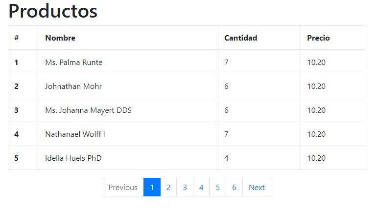

<h1>Pasos para instalación</h1>
Realiza los siguientes pasos:
 
1- Clonar o descargar este repositorio. 
2- Instalar las dependencias de Composer con composer install. 
3- Crea el archivo .env y configura las credenciales de base de datos. 
4- Generar una API key para la aplicación con php artisan key:generate 
5- Ejecuta las migraciones y seeders con php artisan migrate --seed 
6- Ejecuta npm install para las dependencias. 
<h3>Video guía :</h3>
https://youtu.be/INqqTlGYttg
